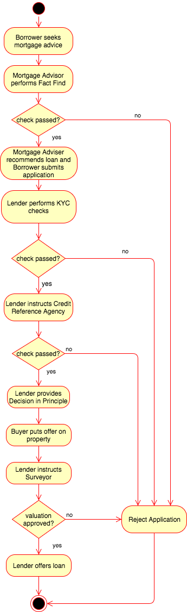

# Blockchain Mortgage Demo
An experimental (and learning) Blockchain project to demonstrate how a UK mortgage application could be processed using
[Hyperledger Fabric](https://www.hyperledger.org/).

_Coming soon... and very much work in progress!_

**Disclaimer:** This is a lay person's (basic) understanding of the UK mortgage and conveyancing process; 
I am not an industry expert and there could well be errors in the use case as well as the code ;-)
This software is provided 'as is' and released under the [Apache 2.0](https://www.apache.org/licenses/LICENSE-2.0.html) license.

## Use Case
A very simplified version of the UK mortgage application process in order to demonstrate the benefits of Blockchain.

### Participating Parties
The following parties will participate in the demo:

1. Buyer/Borrower - wants to purchase a property and apply for a loan.
1. Mortgage Advisor - advises Borrower and assists with mortgage application.
1. Lender - offers the loan.
1. Credit Reference Agency - performs credit check on behalf of the Lender. 
1. Surveyor - performs property valuation on behalf of the Lender.
1. Regulator - Financial Conduct Authority (FCA) oversees all lending activities.

### Mortgage Application Process
This is a cut-down version of the process as seen from the point of view of the Buyer.

The flow below assumes a successful application:

1. Buyer/Borrower seeks mortgage advice.
1. Mortgage Advisor performs Fact Find (responsible lending check) and recommends loan based on Borrower's circumstances.
1. Buyer/Borrower applies for loan with selected Lender.
1. Lender performs Know Your Customer (KYC) on Borrower.
1. Lender instructs Credit Reference Agency to perform financial check on Borrower.
1. Lender provides Decision in Principle (DIP) to provide loan to Borrower.
1. Buyer/Borrower puts offer on property and formalises loan application.
1. Lender instructs Surveyor to value the property.
1. Lender approves application and provides offer of loan to Borrower.

The Regulator can oversee the mortgage lending process throughout. 

#### The Mortgage Asset
Mortgage applications are modeled on the Blockchain using the following attributes:

| Attribute               | Type/Purpose                                                                 |
| ----------------------- | ---------------------------------------------------------------------------- |
| ApplicationId           | Unique string used to identify the mortgage application. |
| Status                  | Current status of mortgage application, e.g. draft, survey_pending, offered, |
| BorrowerName            | Name of Borrower. |
| BorrowerAddress         | Borrower's current address. |
| MortgageAdviserId       | Identity of Mortgage Adviser |
| LenderId                | Identity of Lender |
| SurveyorId              | Identity of Surveyor | 
| CreditReferenceAgencyId | Identity of Credit Reference Agency |
| PropertyValuation       | Valuation of property given by Surveyor |
| CreditScore             | Credit score for Borrower |

#### Transactions Recorded
At different stages of the process, transactions are recorded on the Blockchain:

1. Initial application for the loan by the Borrower.
1. Mortgage Advisor's Fact Find check result.
1. Lender's KYC check result.
1. The Credit Reference Agency's credit check result.
1. The Lender's Decision in Principal.
1. The Surveyor's valuation report.
1. The Lender's formal offer of loan.

#### Participant Permissions
The demo is designed to allow participants to interact with the mortgage asset by creating, updating and 
terminating it as their permissions allow. The participants included in the demo are:

| Participant             | Permissions                                                              |
| ----------------------- | ------------------------------------------------------------------------ |
| Mortgage Advisor        | Create, Read (Own mortgages), Update (Status), Reject |                          |
| Borrower                | Read (Own mortgage), Update (BorrowerName, Address), Reject |
| Lender                  | Read (Own mortgages), Update (Status), Reject |
| Credit Reference Agency | Read (Own references), Update (Status, creditScore) |
| Surveyor                | Read (Own surveys), Update (Status, PropertyValuation) |
| Regulator               | Read (All applications)

### Blockchain Features
Some of the key features of Blockchain being used are:

1. Trust/Consensus - Lender trusts Mortgage Adviser's Fact Find check, Credit Reference Agency score, etc...
1. Immutability - the ledger provides a tamper-proof history of all the transactions that occurred during the application. 
1. Privacy - participants only see transactions they're entitled to see. It's a permissioned ledger.
1. Smart Contracts - verifiable, searchable, immutable, encrypted.

### Blockchain Benefits
1. Borrower can check on application status at any time.
1. Mortgage Adviser and Lender can record Fact Find and KYC checks on the Blockchain to satisfy Regulatory requirements.
1. Regulator can see all of transactions in the application process.
1. Helps prevent fraudulent activity - it provides a tamper-proof financial audit trail.
1. Speeds up application process by removing intermediaries and custom point-to-point integration of parties.

## User Guide
TODO

### Prerequisites
TODO

### Building & Installation
#### Local Deployment
TODO

#### IBM Bluemix Deployment
TODO

### Running the Demo
TODO
